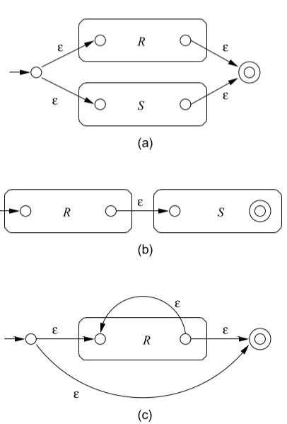

Continuo state elimination:
		procedura funziona per ogni tipo di FA

TEOREMA: per ogni regular expression $R$ si può costruire $\epsilon$-NFA $E$ tale che $L(E)=L(R)$
	Costruiamo $E$ con solo uno stato finale, no archi entranti in stato iniziale e no archi uscenti da stato finale -> costruito con STRUCTURAL INDUCTION: applicata in casi dove non c'è ordine totale, ma piuttosto struttura ad albero -> vale per ogni caso base possibile, poi mostrare che, se ho operatore e proprietà vale per componenti, proprietà vale per risultato
	- base: automata per regex $\epsilon, \varnothing, \textbf{a}$ -> arco con $\epsilon$, no arco, arco con $a$
	- induzione: automata per +, ., * (non cambia automata con parentesi): 
	  - unione: scelti uno dei due
	  - concatenazione: scelti entrambi
	  - kleene closure: o non si sceglie, o si sceglie tot volte
(alla fine, deve esserci solo uno stato finale)

Similitudini tra regular expressions e espressioni aritmetiche:
- prop. commutativa per unione
- prop. associativa per unione
- prop. associativa per concatenazione
  (concatenazione NON è commutativa)
- $\varnothing$: identità per unione
- $\epsilon$: identità sinistra/destra di concatenazione
- $\varnothing$: annichilitore sinistro/destro di concatenazione
- prop. distibutiva a sinistra/destra di concatenazione su unione
- prop. idempotent per unione
- per kleene closure: $(L^*)^*=L^*$, $\varnothing^*=\epsilon$, $\epsilon^*=\epsilon$, $L^+=LL^*=L^*L$, $L^*=L^++\epsilon$, $L?=\epsilon+L$
Dimostrazione prima proprietà di kleene closure:
	$L((R^*)^*) = (L(R^*))^* = ((L(R))^*)^*$; $L(R^*)=(L(R))^*$ -> bisogna dimostrare che $(L^*_R)^* = L_R^*$ dato che $L(R)=L_R$
	$$w \in (L_R^*)^* \iff w \in \bigcup_{i=o}^{\infty} (\bigcup_{j=o}^{\infty} L_R^j)^i \iff \exists k,m \in \mathbb{N} | w \in (L_R^m)^k = \exists p \in \mathbb{N} | w \in L_R^p \iff ...$$

Esempio 2, dimostrazione:
	dato DFA A, $Inf(A)$: si costruisce nuovo final state fuori dal DFA
	se colleghiamo a start ad ogni stato inizio loop con 
	soluzione a questo problema: collegare a final stato tutti stati tranne trap state, e collegare a stato iniziale tutti tranne unreachable