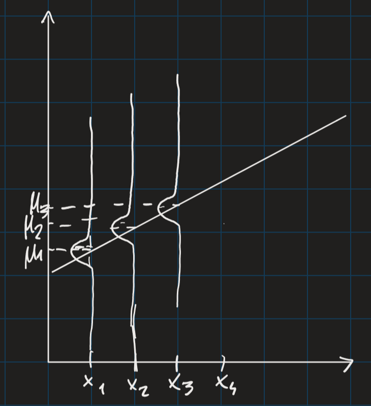

Sia $X_1,...,X_n$ con $X_i \sim F_{\theta}$ ($\theta$ parametro che ci interessa); se sono indipendenti si dice IID RANDOM SAMPLE -> STATISTICAL MODEL: $$\{f(x_1,...,x_n;\theta):\theta\in\Theta,x_i\in\mathbb{X}\}$$$\Theta$: PARAMETER SPACE (possibili valori di parametro); $f$ densità congiunta -> di solito, $\Theta\subseteq\mathbb{R}^d$ per un intero non nullo $d$, $X_i$ può essere rv o rve di qualunque dimensione

In molti casi irrealistico pensare che sample sia iid

LINEAR REGRESSION:
	sample: $x_1,...,x_n$ fisso, $y_1,...,y_n$ realizzazione di $Y_1,...,Y_n$ -> modello: $$Y_i|x_i \sim N(\mu_i,\sigma^2), \quad \mu_i=\beta_0+\beta_1x_i, \ i\in[1,n] \quad Y_i \text{ indipendente da } Y_j \ \forall i,j$$Parametro: $(\beta_0,\beta_1,\sigma^2)$
	Statistical model: $$\left\{\frac{1}{(2\pi\sigma^2)^{n/2}}e^{-\frac{1}{2\sigma^2}\sum_i(y_i-\beta_0-\beta_ix_i)^2}:\beta_0,\beta_1\in\mathbb{R},\sigma^2>0,y_i,x_i\in\mathbb{R} \ \forall i\right\}$$
	
Varianza non cambia -> per questo è lineare

LOGISTIC REGRESSION:
	$x_{i1},...,x_{ip}$ sample con $p$ caratteristiche, $y_1,...,y_n$ sample discreto -> modello: $$Y_i|x_{i1},...,x_{ip} \sim Ber(\theta_i), \quad \theta_i=\frac{1}{1+e^{-\mu_i}}, \quad \mu_i = \beta_0+\beta_1x_{i1}+...+\beta_px_{ip}, \quad Y_i,Y_j \text{ ind. } \forall i,j$$Densità congiunta: $$f(y_1,...,y_n|\textbf{X},\theta)=\prod_{i=1}^n \left(\frac{1}{1+e^{-(\beta_0+\beta_1x_{i1}+...+\beta_px_{ip})}}\right)^{y_i}\left(\frac{1}{1+e^{\beta_0+\beta_1x_{i1}+...+\beta_px_{ip}}}\right)^{1-y_i}$$Statistical model: $$\{f(y_1,...,y_n|\textbf{X},\theta):\theta=(\beta_0,...,\beta_p)\in\mathbb{R}^{p+1}\}$$

## LIKELIHOOD FUNCTION
Essenziale per inferential statistics
	Sia $X_1,...,X_n$ iid sample con pdf $f(x;\theta)$ per ogni rv -> LIKELIHOOD FUNCTION $$L(\theta):\Theta\rightarrow\mathbb{R}_{\geq0}; \quad L(\theta)=\prod_{i=1}^nf(X_i;\theta)$$(versione random sample)
Simile ma non uguale a pdf congiunta (lik. vs. pdf):
- funzione di $\theta$ fissando $x_1,...,x_n$ vs. funzione di $x_1,...,x_n$ fissando $\theta$
- non garantito vs. garantito che integri a 1

Per sample di rv discrete, $L(a)$ interpretabile come probabilità di osservare certo sample sotto certo modello quando $\theta=a$
Per sample di rv continue, interpretabile come: più alto $L$ più probabile osservare certo sample
In generale, rappresenta probabilità di osservare certo sample
$\theta$ che massimizza likelihood: MAXIMUM LIKELIHOOD ESTIMATE: $$\hat{\theta} = \text{argsup}_{\theta\in\Theta}L(\theta)$$