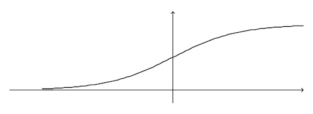

LOGISTIC REGRESSION: si impara funzione $h:\mathbb{R}^d\rightarrow[0,1]$ -> utile per classificazione (soprattutto binaria, ma anche multiclasse)
Classe di ipotesi: $\mathbb{H}:\phi_{sig}\circ L_d$, (phi sigmoide) -> sigmoide: "funzione a S" -> per logistic regression: $$\phi_{sig}(z)=\frac{1}{1+e^{-z}}$$(z: output di modello lineare)

$h(\textbf{x})=1$ -> alta sicurezza che label di $x$ sia 1
$h(\textbf{x})=0$ -> alta sicurezza che label di $x$ sia -1
$h(\textbf{x})\approx\frac{1}{2}$ -> non siamo sicuri di label
Quindi: $$H_{sig}=\phi_{sig}\circ L_d=\{\mathbf{x}\rightarrow\phi_{sig}(\langle\textbf{w},\textbf{x}\rangle):\textbf{w}\in\mathbb{R}^{d+1}\} \Longrightarrow h_{\textbf{w}}(\textbf{x})=\frac{1}{1+e^{-\langle\textbf{w},\textbf{x}\rangle}}\in H_{sig}$$Differenza principale per $\langle\textbf{w},\textbf{x}\rangle\approx0$:
- semispazi: predizione è 1 o -1, è deterministico
- phi sigmoide: incertezza in label predetta per circa 1/2

Loss function:
	vera label $y=\pm1$
	$h_{\textbf{w}}(\textbf{x})$ -> cosa vogliamo:
	- se $y=1$ -> vogliamo valore grande
	- se $y=-1$ -> vogliamo valore piccolo
	$$1-h_{\textbf{w}}(\textbf{x})=\frac{1}{1+e^{\langle\textbf{w},\textbf{x}\rangle}}$$Loss function dovrebbe crescere in modo monotono con $\frac{1}{1+e^{y\langle\textbf{w},\textbf{x}\rangle}}$ -> possiamo usare $1+e^{-y\langle\textbf{w},\textbf{x}\rangle}$ -> LOSS FUNCTION: $$l(h_{\textbf{w}},(\textbf{x},y))=\text{log}(1+e^{-y\langle\textbf{w},\textbf{x}\rangle})$$
	Problema ERM dato training set $S$: $$\text{argmin}_{\textbf{w}\in\mathbb{R}^d}\frac{1}{m}\sum_{i=1}^m\text{log}(1+e^{-y_i\langle\textbf{w},\textbf{x}_i\rangle})$$Funzione convessa -> possiamo risolvere facilmente
	Definizione loss (e quindi definizione ERM) sembra arbitraria -> stessa formulazione derivante da MAXIMUM LIKELIHOOD ESTIMATION (MLE)

MAXIMUM LIKELIHOOD ESTIMATION (MLE):
	approccio statistico per trovare parametri che massimizzano prob. congiunta di dataset supponendo che ci sia specifica funzione prob. parametrica
	approccio generale:
	- dato training set, supponiamo che ogni coppia sia i.i.d. con certa distr. con parametro $\theta$
	- prendiamo $\mathbb{P}[S|\theta]$ (LIKELIHOOD FUNCTION)
	- LOG LIKELIHOOD: $L(S;\theta)=\text{log}(\mathbb{P}[S|\theta])$
	- MAXIMUM LIKELIHOOD ESTIMATOR: $\hat{\theta}=\text{argmax}_\theta L(S;\theta)$
	Per logistic regression:
		supponiamo vettori $\textbf{x}_i$ -> probabilità che abbia $y=1$:$$h_{\textbf{w}}(\textbf{x}_i)=\frac{1}{1+e^{-\langle\textbf{w},\textbf{x}_i\rangle}}$$qui parametro è $\textbf{w}$
		prob. che sia -1: $$(1-h_{\textbf{w}}(\textbf{x}_i))=\frac{1}{1+e^{\langle\textbf{w},\textbf{x}_i\rangle}}$$per ogni i, prob. che vettore abbia label $y_i$: $$\frac{1}{1+e^{-y_i\langle\textbf{w},\textbf{x}_i\rangle}}$$likelihood di training set: $$\prod_{i=1}^m\left(\frac{1}{1+e^{-y_i\langle\textbf{w},\textbf{x}_i\rangle}}\right)$$log likelihood: $$\text{log}\left[\prod_{i=1}^m\left(\frac{1}{1+e^{-y_i\langle\textbf{w},\textbf{x}_i\rangle}}\right)\right]=\sum_{i=1}^m\text{log}\left(\frac{1}{1+e^{-y_i\langle\textbf{w},\textbf{x}_i\rangle}}\right)=\sum_{i=1}^m\left(\text{log}1-\text{log}(1+e^{-y_i\langle\textbf{w},\textbf{x}_i\rangle})\right)=$$$$=-\sum_{i=1}^m\text{log}(1+e^{-y_i\langle\textbf{w},\textbf{x}_i\rangle})$$maximum likelihood estimator: $$\text{argmax}_{\textbf{w}\in\mathbb{R}^d}-\sum_{i=1}^m\text{log}(1+e^{-y_i\langle\textbf{w},\textbf{x}_i\rangle})=\text{argmin}_{\textbf{w}\in\mathbb{R}^d}\sum_{i=1}^m\text{log}(1+e^{-y_i\langle\textbf{w},\textbf{x}_i\rangle})$$soluzione equivalente a soluzione ERM

## UNIFORM CONVERGENCE
Vogliamo capire quando classe (infinita) di ipotesi è PAC learnable
UNIFORM CONVERGENCE: empirical risk di ogni membro di $\mathbb{H}$ sono buone approssimazioni del generalization error (uniform legato a ogni) -> training set si dice $\epsilon$-REPRESENTATIVE: $$\forall h\in\mathbb{H},|L_S(h)-L_{\mathbb{D}}(h)|\leq\epsilon \Longrightarrow L_S(h)-\epsilon\leq L_{\mathbb{D}}(h)\leq L_S(h)+\epsilon$$
Prop:
	se training set è $\frac{\epsilon}{2}$-representative, ogni output ERM su training set si soddisfa $$L_\mathbb{D}(h_S)\leq \text{min}_{h\in\mathbb{H}}L_\mathbb{D}(h)+\epsilon$$
	Dim:
		$$\forall h\in\mathbb{H} \quad L_\mathbb{D}(h_S)\leq L_S(h_S)+\frac{\epsilon}{2} \leq L_S(h)+\frac{\epsilon}{2}\leq L_\mathbb{D}(h)+\frac{\epsilon}{2}+\frac{\epsilon}{2}\leq L_\mathbb{D}(h)+\epsilon$$Vero anche per $h=\text{argmin}_{h'\in\mathbb{H}}L_\mathbb{D}(h')$: $$L_\mathbb{D}(h_S)\leq \text{min}_{h\in\mathbb{H}}L_\mathbb{D}(h)+\epsilon$$

Quando abbiamo uniform convergence?
UNIFORM CONVERGENCE PROPERTY PER CLASSE DI IPOTESI: $\exists \ m_\mathbb{H}^{UC} : (0,1)^2\rightarrow\mathbb{N}$ tale che per ogni coppia di parametri e distr., se S ha abbastanza dati, S è $\epsilon$-representative con prob. abbastanza alta
Prop: se classe ha uniform convergence property con funzione $m_\mathbb{H}^{UC}$ allora classe è agnostic PAC learnable con $m_\mathbb{H}(\epsilon,\delta)\leq m_\mathbb{H}^{UC}(\epsilon/2,\delta)$ -> in questo caso paradigma ERM è successful agnostic pac learner per classe
Ogni vogliamo sapere quali classi hanno uniform convergence

Classi finite sono agnostic PAC learnable con restrizioni su loss:
	con loss tra 0 e 1:
	- $\mathbb{H}$ ha uniform convergence property con sample complexity $$m_\mathbb{H}^{UC}(\epsilon,\delta)\leq\left\lceil\frac{log(2|\mathbb{H}|/\delta)}{2\epsilon^2}\right\rceil$$
	- è anche agnostically PAC learnable con $$m_\mathbb{H}(\epsilon,\delta)=m_\mathbb{H}^{UC}(\epsilon/2,\delta)\leq\left\lceil\frac{2log(2|\mathbb{H}|/\delta)}{\epsilon^2}\right\rceil$$
	Dim:
		piano:
		1 - provare che uniform convergence vale per classe finita
		2 - usare questo risultato su uniform convergence e PAC learnability
		usiamo HOEFFDING INEQUALITY:
			$\theta_1,...,\theta_m$ sequenza di rv i.i.d., per ognuna media $\mu$ e $\mathbb{P}[a\leq\theta_i\leq b]=1$, per ogni $\epsilon>0$: $$\mathbb{P}\left[\left|\frac{1}{m}\sum_{i=1}^m\theta_i-\mu\right|>\epsilon\right]\leq2e^{-\frac{2m\epsilon^2}{(b-a)^2}}$$(media delle osservazioni vicine ad aspettazione)
		Vera dim:
		fissiamo $\epsilon,\delta\in(0,1)$ -> ci serve dimensione sample $m:\forall\ \mathbb{D}$, con probabilità $\geq1-\delta$ su scelta di training set (coppie $z_i$ i.i.d.), abbiamo $\forall \ h\in\mathbb{H}, |L_S(h)-L_\mathbb{D}(h)|\leq\epsilon$ -> ovvero, trovare: $$\mathbb{D}^m(\{S:\forall \ h\in\mathbb{H},|L_S(h)-L_\mathbb{D}(h)|\leq\epsilon\})\geq1-\delta$$Guardiamo a evento complementare:$$\mathbb{D}^m(\{S:\exists \ h\in\mathbb{H}:|L_S(h)-L_\mathbb{D}(h)|>\epsilon\})<\delta$$($\mathbb{D}^m(\{S:\exists \ h\in\mathbb{H}:|L_S(h)-L_\mathbb{D}(h)|>\epsilon\})=(*)$)
		Abbiamo: $$\{S:\exists \ h\in\mathbb{H},|L_S(h)-L_\mathbb{D}(h)|>\epsilon\}=\bigcup_{h\in\mathbb{H}}\{S:|L_S(h)-L_\mathbb{D}(h)|>\epsilon\}$$Per union bound: $$(*)\leq\sum_{h\in\mathbb{H}}\mathbb{D}^m(\{S:|L_S(h)-L_\mathbb{D}(h)|>\epsilon\}) \quad (**)$$