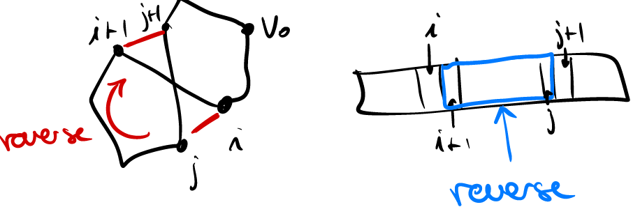

Algoritmo GREEDY: ad ogni iterazione, cerco l'arco incidente il vertice attuale con costo minimo $(v,h)=\text{argmin}\{(i,j):i\text{ last}, j\text{ unvisited}\}$ -> alla fine collego ultimo vertice con primo
Implementazione $O(n^2)$ con n nodi -> lineare in numero di archi (per grafo completo)
Se ho tempo, provo più nodi iniziale e salvo migliore (lista, costo, tempo necessario per computazione) -> se scelgo opzione verbose, plotto tutte soluzioni trovate
In update soluzione, check di congruenza:
- no duplicati in lista
- ricalcolo costo soluzione
NO CONFRONTO DIRETTO DI DOUBLE -> usare $\epsilon$ (e.g. $10^{-8}$)
Opzionale: 2-OPT -> tagliare intrecci in soluzione  -> invertendo elementi in lista

Condizione per farlo: $c_{i,i+1}+c_{j,j+1}>c_{i,j}+c_{i+1,j+1}$ -> applicandola non serve cercare intreccio -> trovo tutte coppie e faccio scambio più favorevole -> ripeto finchè non trovo più miglioramenti