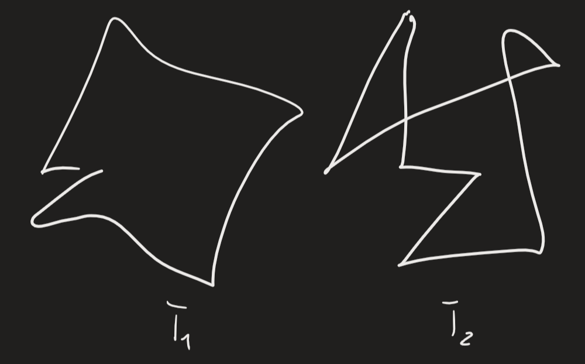
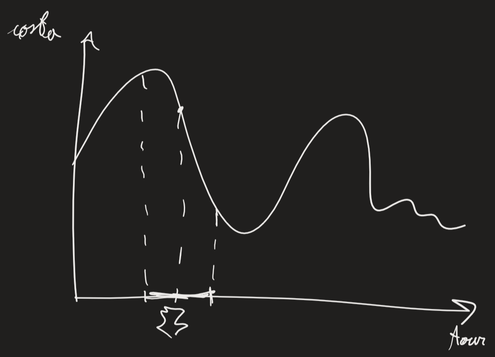

Greedy: esempio di CONSTRUCTIVE HEURISTICS: parte da 0 e trova soluzione -> altro esempio: EXTRA MILEAGE (non da implementare):
	dato ciclo, aggiungervi iterativamente nuovo vertice
	iterativo: dati $C$ lati di ciclo ($V(C)$ vertici di ciclo), dato $h\notin V(C)$ conviene inserirlo in posizione più conveniente -> considero tutti lati di ciclo e calcolo extra mileage -> prendere minimo $$EM(h,(i,j))=c_{ih}+c_{hj}-c_{ij} \ \forall \ (i,j)\in C,h\notin V(C)$$operazione $O(N^2)$
	inizializzazione: prendere due o tre vertici lontani in modo arbitrario, quello è ciclo

Greedy è deterministico -> delle volte utile randomizzare -> per greedy, tecnica GRASP (non da implementare):
	dato algoritmo che fa scelta "ottima" ad ogni iterazione, facciamola con probabilità 99% -> con probabilità bassa (e.g. 1%), anzichè prendere minimo va a secondo minimo, oppure scegliere casuale tra 5 minimi, oppure lato casuale
	definire prob. $p$ di deviare da scelta "ottima"
Consiglio: prima iterazione con $p=0$, successive settare $p$ piccola
Variare seed con iterazioni
O provo tutti vertici (genero soluzioni non troppo diverse) oppure sempre stesso iniziale usando grasp

METAHEURISTICS: non euristica specifica, ma idea a livello superiore su come fare euristiche
Scenario 2-opt:
	
	percorsi $T_1,T_2$ su stessi vertici -> distanza $\Delta(T_1,T_2)=$ numero di lati diversi fra $T_1$ e $T_2$ $=|T_1\setminus T_2|$
	data soluzione $T_0$: $N(T_0,2)=\text{2-opt}$: insieme di soluzioni ottenibili da $T_0$ cambiando massimo 2 lati -> definisco intorno (neighbourhood) -> $T_0\in N(T_0,2)$
	con algoritmo 2-opt, stiamo facendo NEIGHBOURHOOD SEARCH
	
	man mano che faccio scambi, cambio intorno
	mi fermo quando non trovo soluzione migliore in intorno di 2-ottimalità -> ottimo locale -> come uscirne?
		- MULTISTART: iniziare da più soluzioni diverse
		- da Fred Glover: TABU SEARCH

TABU SEARCH, idea generale:
	siamo partiti da $T_0$ e l'abbiamo migliorato cercando in intorni, siamo arrivati in ottimo locale
	ho scambio che mi porta a soluzione peggiore -> considero tutti scambi: se variazione migliore è negativa, mi sposto -> creo una lista dove definisco mossa per tornare indietro come MOSSA TABù -> da lì, proseguo facendo così
	andando avanti così, ritroverò solo mosse che migliorano -> ritorno a scendere -> quando torno a minimo, ricomincio a definire mosse tabù
Questioni delicate:
- man mano lista tabù cresce, meno libertà ho di crescere -> devo svuotarla man mano -> posso definire dimensione massima (chiamata TENURE) -> quando raggiungo tenure, elimino primo tabù -> tenure è iperparametro: meglio che sia legato a n -> meglio non fare overtuning -> opzione REACTIVE TABU: definisco tenure massima e minima, e regola che fa cambiare tenure durante fasi
- definire bene mossa tabù -> se come mosse peggiorativa ho aggiunto intreccio, devo evitare di scioglierlo -> potrei aggiungere (i,j,h,k) a lista tabù -> oppure mettere solo (i,j): non voglio mettere quel lato -> oppure solo uno dei vertici: non faccio nessuna mossa che tocca quel vertice -> oppure aggiungo vertici di lato in intreccio
	potrei definire iterazione di tabù attuale chiamato ITER; lista TABU dove per ogni vertice ho valore di iter -> per sapere se vertice è tabù, confronto iter con tabu[h]+tenure