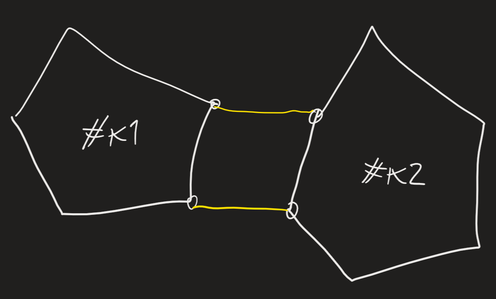

Dato funzionamento Benders, vogliamo migliorarlo
Difetto: trova soluzione ammissibile TSP solo a ultima iterazione -> se non raggiungo, ottengo solo un lower bound -> ad ogni iterazione, restituisce collezione di cicli con costo $\leq$ costo di soluzione ottima
Algoritmo di PATCHING:
	scegliamo due lati appartenenti a cicli diversi -> per incollarli, posso sostituirli minimizzando modifica di costo
	
	(simile a 2opt)
	abbiamo vettore comp, succ -> eliminiamo lati (i, succ[i]) e (j, succ[j]) -> facciamo girare i e j su loro componenti -> $\Delta costo_{i,j} = c[i,succ[j]]+c[j,succ[i]]-c[j,succ[j]]-c[j,succ[j]]$ -> prendiamo delta minimo
	- orientamento componenti deve essere congruente
	- consigliato dare nomi a succ[i] e succ[j]
	- devo stare attento a non considerare stesso scambio due volte (posso descriverlo due volte) -> posso stabilire regola $k1<k2$
	potrei incollarli anche creando intreccio -> potrebbe essere migliorativo -> potrei applicare 2opt dopo
	attenzione a numeri componenti che saltano
	si può scegliere vertice start per ogni componente 

Algoritmo:
	in input, comp e succ -> in output, unica componente e comp, succ congruenti

Verrà usata anche in B&C -> dobbiamo portare separazione SEC e anche patching dentro albero decisionale -> meglio creare metodi thread-safe

TODO: creare array con nodi iniziali di componenti