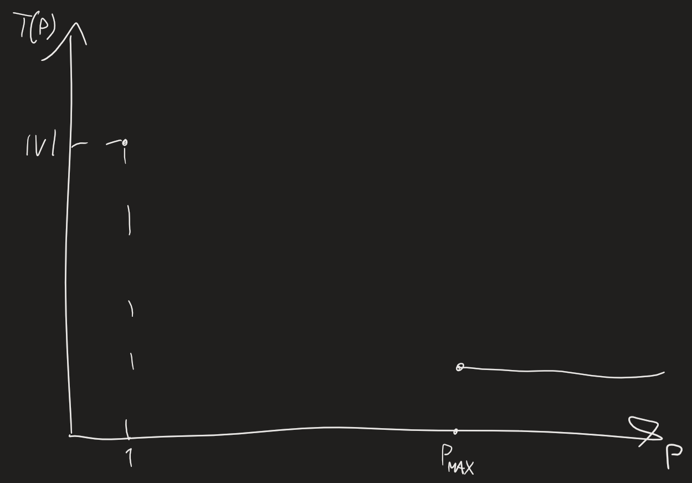
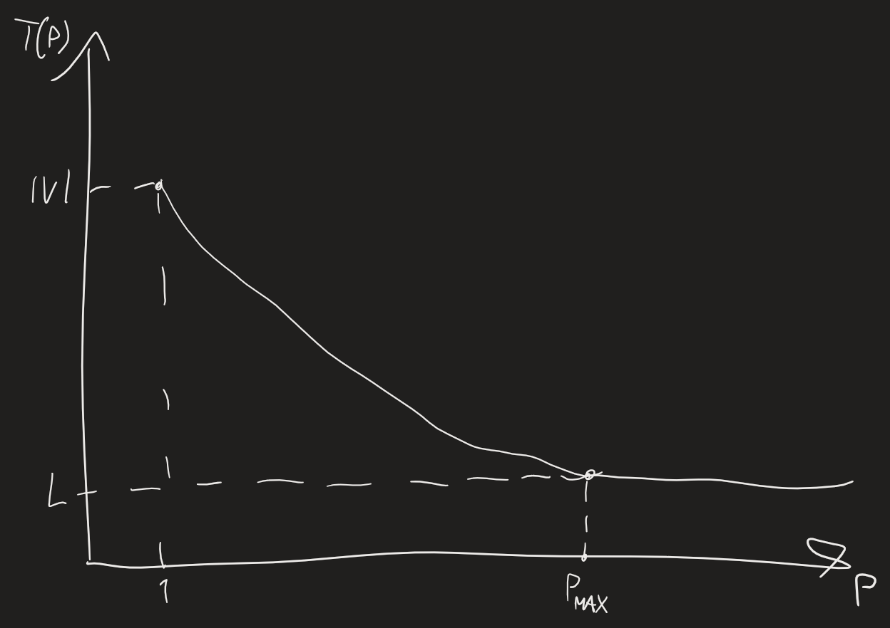
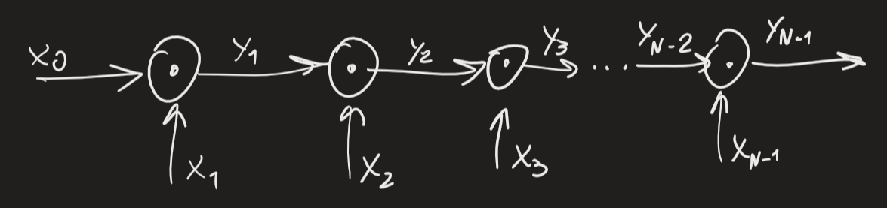
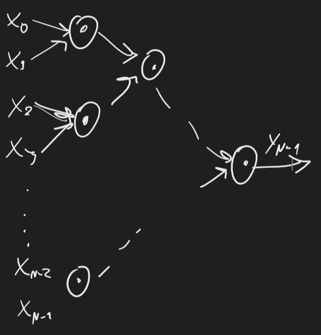

Dato CDAG $(I,V,E)$, $T(P)$ tempo minimo di esecuzione su $IM(P)$

Lower bound:
- $T(P)\geq\frac{|V|}{P}$ (WORK LOWER BOUND) -> possibile arrivare a 1 solo se non ci sono data-dependence chains
- $T(P)\geq L$ (critical length, lunghezza di critical path in CDAG)
- se $P\geq \max_{j=1}^L|V_j|$, allora $T(P)=L$ -> $P_{max}\leq\max_{j=1}^L|V_j|$
Trovare $P_{max}$ è problema NP-completo -> ritardare un'operazione ha reazione a catena
Primo lower bound: $$T(P)\geq\frac{|V|}{P} \quad \Rightarrow \quad P_{max}\geq\frac{|V|}{T(P)}\quad\Rightarrow\quad\frac{|V|}{T(P)}\leq P_{max}\leq\max_{j=1}^L|V_j|$$Considerando greedy schedule: $$T(P)\leq\sum_{j=1}^L\left\lceil\frac{|V_j|}{P}\right\rceil$$Manipolare formula rilassando upper bound: $$T(P)<\sum_{j=1}^L\left(\frac{|V_j|}{P}+1\right)=\frac{|V|}{P}+L$$
Vogliamo affermare che: $$\max\left(\frac{|V|}{P},L\right)<T(P)<\frac{|V|}{P}+L \quad \Rightarrow \quad \max\left(\frac{|V|}{P},L\right)<T(P)\leq2\max\left(\frac{|V|}{P},L\right)$$Quanto utilizzo è garantito per processori? Numero di operazioni: $$P\cdot T(P)\leq2|V|$$2 fattore arbitrario, siamo felici se questo è numero di operazioni -> processori occupati per metà del tempo, non spreco troppo potenziale
Definiamo $P^*$: se riesco a eseguire computazione in tempo minimo, in media dovrò eseguire $P^*$ operazioni -> lo definiamo GRADO DI PARALLELISMO di algoritmo: $$P^*=\frac{|V|}{L}$$Prendiamo condizione di prima: $$P^*\cdot T(P^*)<P^*\left(\frac{|V|}{P^*}+L\right)=|V|+P^*L=|V|+|V|=2|V|$$$$T(P^*)<\frac{|V|}{P^*}+L=2L$$

## PREFIX COMPUTATION
Es: data sequenza di interi, vogliamo calcolare somme progressive, somme di ogni prefisso di sequenza ($x_0$, $x_0+x_1$, etc.)
In generale, data sequenza con operazioni associative, definiamo SEMIGROUP $\langle A,\cdot \rangle$
- $A$: insieme
- $\cdot$: operazione $A\times A\rightarrow A$ associativa: $\forall \ x,y,z\in A, (x\cdot y)\cdot z = x \cdot (y\cdot z)$
PREFIX COMPUTATION:
	input: sequenza $\mathbf{x}=(x_0,x_1,\ldots,x_{N-1})\in A^N$
	output: sequenza $\mathbf{y}=(y_0,y_1,\ldots,y_{N-1})\in A^N$; $\forall j\in[1,N-1], y_j=y_{j-1}\cdot x_j$ (oppure $\forall j\in[1,N-1], y_j=x_0\cdot x_1\cdot...\cdot x_j; y_0=x_0$)
Algoritmo scritto con CDAG:

$$I=\{x_0,x_1,\ldots,x_{N-1}\}; \quad V=\{y_1,y_2,\ldots,y_{N-1}\}$$
$$|V|=N-1; \quad L=N-1; \quad P^*=\frac{|V|}{L}=\frac{N-1}{N-1}=1$$Alternativa parallela, ignorando risultati intermedi: 

$$T(N/2)=\log_2N=L; \quad P^*=\frac{|V|}{L}=\frac{N-1}{\log_2N}$$Costruiamo alberi sempre più grandi per $y_1,y_2,\ldots,y_{N-1}$ -> posso eseguirli in parallelo -> eseguo tanto lavoro, non contento: $$|V|=\sum_{j=1}^{N-1}j=\frac{N(N-1)}{2}$$