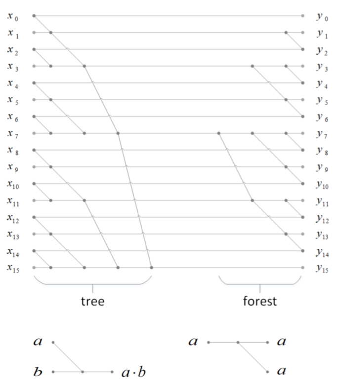
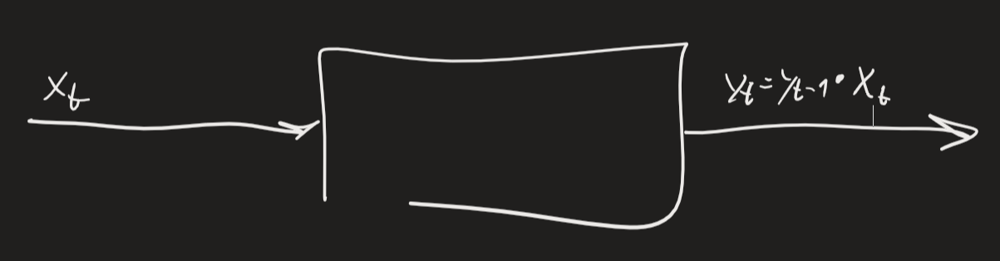

Algoritmo parallelo per prefix computation: TWISTED REFLECTED TREE (TRT)

Per renderlo albero, si aggiunge linea fittizia sopra $y_0$ e tutti rami che finiscono in output si collegano là
Usiamo SEMIGROUP MULTIPLIER -> ordine conta (non commutativa)
Analisi algoritmo: $$L\leq2\log_N; \quad |V|\leq2(N-1); \quad P^*=\frac{|V|}{L}\approx\frac{N-1}{\log_2N}$$Immaginiamo sistema che va avanti per tempo indefinito (istante $t$):
