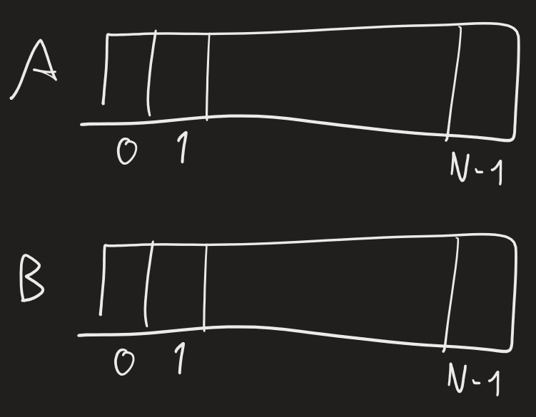

Esercizio:
	
	Chiamiamo v pivot -> dividiamo B in elementi $<v$ e $\geq v$
	Abbiamo P=N processori -> possiamo fare confronti $A[i] \ ? \ v$ in parallelo (confronto con indice $i$ fatto da processore $i$) -> salvati come bit in array associato ad A
	come fare in modo che ogni processore abbia locazione precisa dove scrivere proprio elemento? -> per elementi che danno 1, processore $i$ salva in $B[f(i)]$, con $f(i)==|\{j<i:A_{bit}[j]=1\}|$
	potremmo usare prefix computation -> operazione somma, sequenza $A_{bit}$ -> $f(i)=\sum_{j=0}^{i-1}A_{bit}[j]$
	possiamo creare POOL OF TASKS -> puntatori a task da far prendere a processori

## EVOLUTION OF FINITE STATE MACHINES
Consideriamo insieme finito di STATI