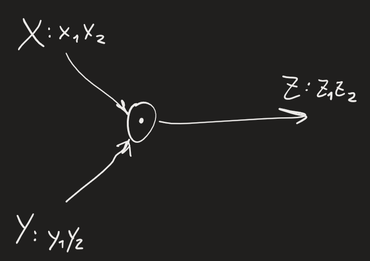
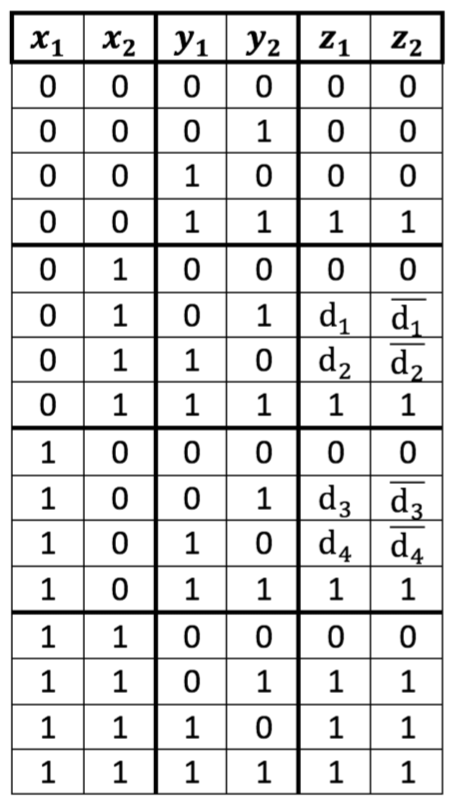
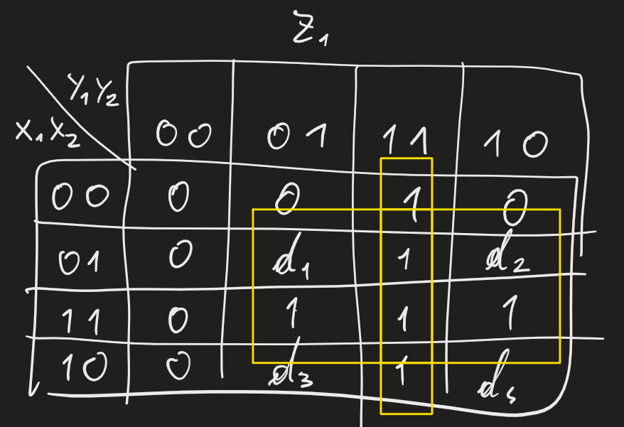
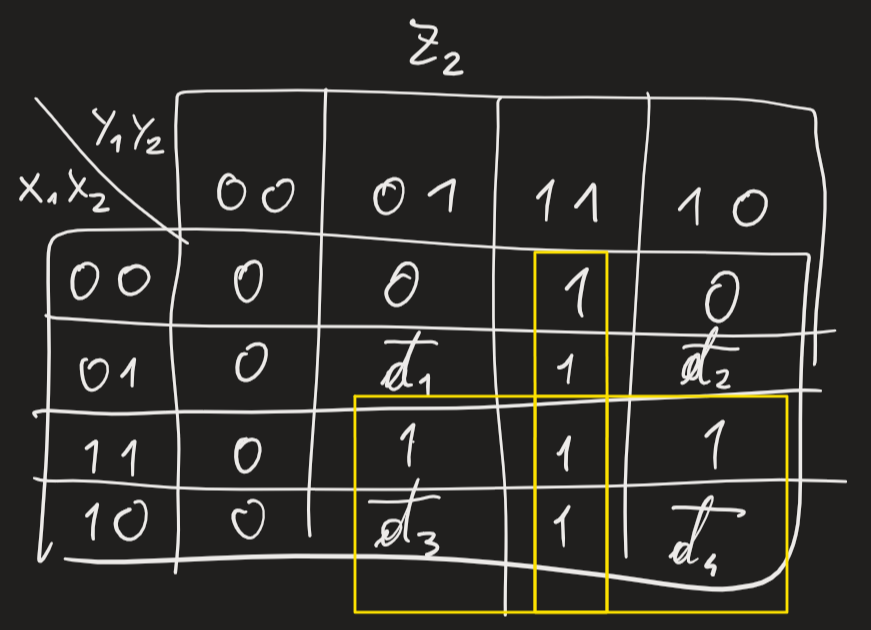
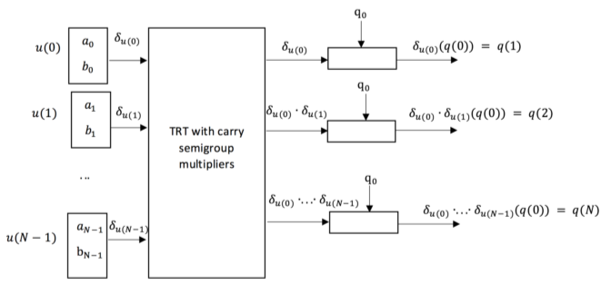

Rappresentazione binaria generatori: P = 01,10; R = 00; S = 11 -> operazioni su generatori saranno operazioni su quei bit
Moltiplicatore semigruppo:

Operazione totalmente determinata da tabella composizioni
Vogliamo convertire simbolo in algoritmo/CDAG
Calcoliamo tabella di verità per moltiplicazione semigruppo:

- $y_1y_2=00=R$ -> risultato sarà sempre R
- $y_1y_2=11=S$ -> risultato sarà sempre 1
- casi $P*P$ particolari -> possiamo mettere qualunque rappresentazione di P -> possiamo tenerci informazione su esistenza di due rappresentazioni -> DON'T CARE CONDITION $d$ -> per evitare 00 e 11, $y_2=\overline{y_1}$
(tabelle di verità proposte da Wittgenstein)

Usiamo mappe di Karnaugh:

Formule risultanti: $z_1=y_1y_2+x_2y_2+x_2y_1$; $z_2=y_1y_2+x_1y_2+x_1y_1$
Controllo correttezza:
- $y_1y_2=11$ quando secondo input è S -> risultato dev'essere S
- secondo fattore è R -> risultato dev'essere 0
- secondo fattore è P -> risultato dev'essere primo input

$X(q)=x_1x_2+x_1q+x_2q$
Lasciare $q_0$ generico utile per altri casi
Lezioni lunedì e martedì con Carlo Fantozzi -> fuori da note (acceleratori hardware, GPU)