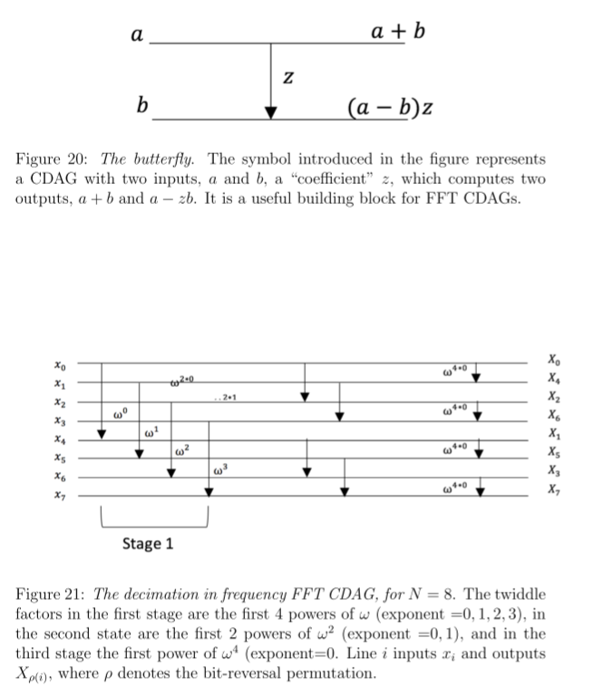

Perfomance algoritmo FFT: $$\begin{cases} T(pq)=qT(p)+pq+pT(q) \\ T(p)=2p^2 & p \mbox{ primo} \end{cases}$$(formula di $T(p)$ approssimata)
Risultato: $$T(N)=2N\chi(N)+N(\nu(N)-1)$$($\chi(N)$: somma fattori primi di $N$, $\nu(N)$: quantità fattori primi di $N$)
Dimostrazione:
	caso base, $N$ primo: $$\nu(N)-1=0, \chi(N)=N \quad \Longrightarrow \quad T(N)=2N^2$$caso induttivo, $N=pq$: $$T(N)=T(pq)=q\cdot(2p\chi(p)+p(\nu(p)-1))+pq+p\cdot(2q\chi(q)+q(\nu(q)-1))$$$$=2pq(\chi(p)+\chi(q))+pq(\nu(p)-1+\nu(q)-1+1)=2N\chi(N)+N(\nu(N)-1)$$
Se $N=2^d$: $$T(N)=2N\cdot2\log_2N+N(\log_2N-1)\approx5N\log_N$$
Lunghezza critica: $$\begin{cases}L(pq)=L(p)+L(q)+1 \\ L(p)=\log_2p+1\end{cases}$$(DFT esprimibile come prodotto tra vettori -> realizzato in parallelo)
Risultato: $$L(N)=\log_2N+2\nu(N)-1$$Dimostrazione:
	caso base, $N$ primo: $$\nu(N)=1 \quad \Longrightarrow \quad L(N)=\log_2N+2-1=\log_2N+1$$caso induttivo, $N=pq$: $$L(pq)=L(p)+L(q)+1=\log_2p+2\nu(p)-1+\log_2q+2\nu(q)-1+1=\log_2N+2\nu(N)-1$$
Upper bound per numero fattori: $\nu(N)\leq\log_2N$ -> upper bound per lunghezza critica: $L(N)\leq3\log_2N$ -> grado di parallelismo con $N=2^d$: $$P^*\approx\frac{5N\log_2N}{3\log_2N}=\frac{5}{3}N$$

Consideriamo $N=2^d$ -> consideriamo $p=2, q=N/2$
$N=2$ -> $\omega=-1$
$$F_{-1}=\begin{bmatrix}\omega^{00} & \omega^{01} \\ \omega^{10} & \omega^{11}\end{bmatrix}=\begin{bmatrix}1 & 1 \\ 1 & -1\end{bmatrix}$$Trasformata di vettore $(z_0,z_1)$: $$\begin{bmatrix}Z_0 \\ Z_1\end{bmatrix}=\begin{bmatrix}1 & 1 \\ 1 & -1\end{bmatrix}\begin{bmatrix}x_0 \\ z_1\end{bmatrix}=\begin{bmatrix}z_0+z_1 \\ z_0-z_1\end{bmatrix}$$Applichiamo algoritmo FFT: $$A_0=\begin{bmatrix}x_0 & \ldots & x_{N/2-1} \\ x_{N/2} & \ldots & x_{N-1}\end{bmatrix}$$Prima computazione: $$A_1=\begin{bmatrix}x_0+x_{N/2} & \ldots & x_{N/2-1}+x_{N-1} \\ x_0-x_{N/2} & \ldots & x_{N/2-1}-x_{N-1}\end{bmatrix}$$Seconda computazione: prima riga hanno sempre fattore 1 ($t=0\Rightarrow\omega^{0s}=\omega^0=1$) $$A_2=\begin{bmatrix}x_0+x_{N/2} & \ldots & x_{N/2-1}+x_{N-1} \\ \omega^0(x_0-x_{N/2}) & \ldots & \omega^{N/2-1}(x_{N/2-1}-x_{N-1})\end{bmatrix}$$Terza computazione: calcoliamo $\text{DFT}_{\omega^2}$ $$A_3=\begin{bmatrix}X_0 & \ldots & X_{N-2} \\ X_1 & \ldots & X_{N-1}\end{bmatrix}$$
Poniamo anello $R=\mathbb{C}$: $$\begin{cases}T(2)=4 \\ T(N)=2T(N/2)+2N+6N/2=2T(N/2)+5N\end{cases}$$

Successivamente, in farfalla $z=\omega^h$