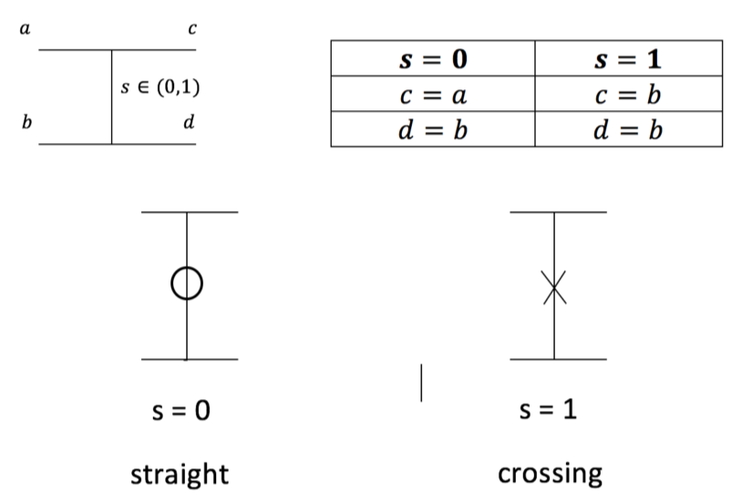
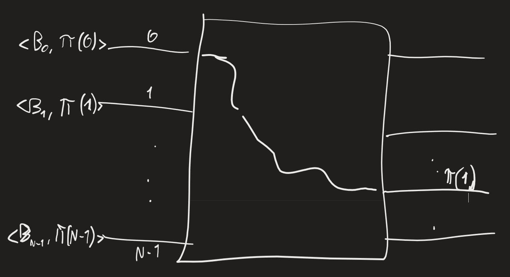

MESSAGE ROUTING -> consideriamo caso semplice: OFF-LINE message routing: sorgenti e destinazioni di messaggi noti a priori
TERMINAL: punti dove messaggio può essere originato -> messaggi hanno header e body
Studiamo PERMUTATION ALGORITHM:
	consideriamo:
	- N terminali sorgente $\{s_0,\ldots,s_{N-1}\}$
	- N terminali destinazione $\{d_0,\ldots,d_{N-1}\}$
	PERMUTATION ROUTING: permutazione $\pi : \{0,\ldots,N-1\} \rightarrow \{0,\ldots,N-1\}$ (funzione invertibile)
	Sorgente $s_i$ manda un messaggio a destinazione $d_{\pi(i)}$ -> sorgenti diverse mandano a destinazioni diverse
	Ci dev'essere coordinazione in permutazione
Blocco base di router: BINARY SWITCH

Ogni switch ha CONFIGURATION BIT $s$ -> output switch: $c=(1-s)a+sb, d=(1-s)b+sa$ -> errore nella tabella: per $s=1$, $d=a$
Risolvere permutation routing: progettare rete di binary switch tale che per ogni permutazione esiste configurazione di switch che la crea -> possibilmente piccola
Per N=2, rete desiderata = un switch
Indichiamo $S$ numero switch in rete -> in permutation network:$$S\geq\log_2(N!)\approx N\log_2N-(\log_2e)N+\text{l.o.t.}$$($\text{l.o.t.}$: termini di ordine minore) (approssimazione arriva da $N!<N^N$)
	dati $S$ switch, possiamo fare $2^S$ reti diverse (reti diverse possono dare stesso risultato)
	$N!$ permutazioni -> $2^S\geq N!$ -> $S\geq\log_2(N!)$
Permutation network abbastanza efficiente -> possiamo ispirarci a rete di bitonic sorting

Potremmo ordinare pacchetti per destinazione -> consideriamo destinazione $\pi(i)$ come sorting key
Routing problema più semplice rispetto a sorting -> sorting fa sorta di online routing -> offline: switch fa sempre stesso lavoro; sorting: comparator decidono sul momento in base a input
Lower bound $\Omega(N\log N)$ per sorting

BENES NETWORK