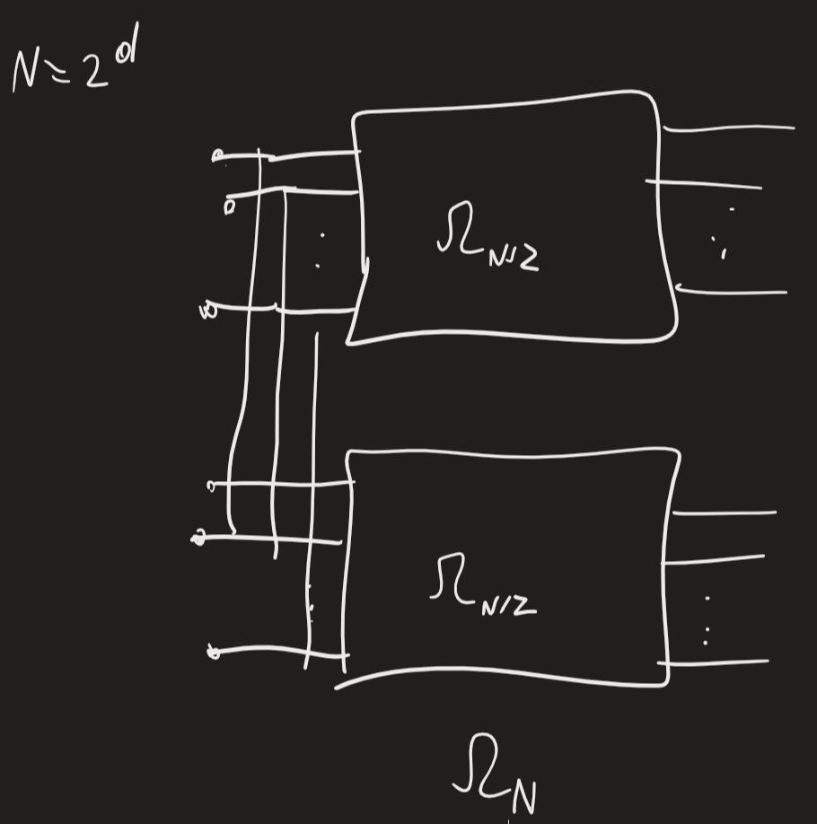
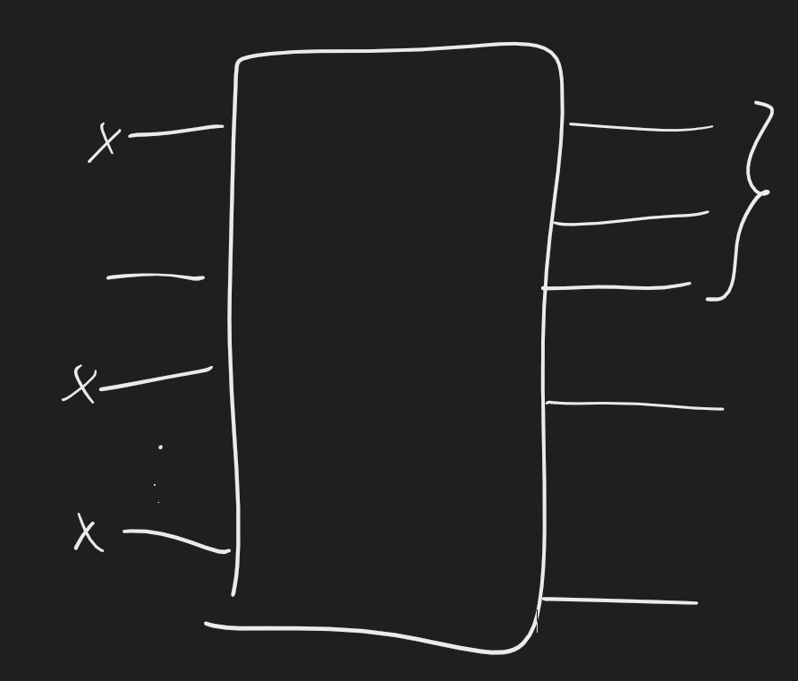

Caso base $\Omega_2$: singolo switch
Questa non può essere permutation network: non ha abbastanza switch
Permutazione più semplice: identity permutation $\pi(i)=i \ \forall i\in[0,N-1]$
Permutazioni invertibili -> costituiscono gruppo
(straight anche detta passing)
Posso realizzare identity permutation con tutti straight
Reversal permutation: $\pi_{rev}(i)=N-1-i \ \forall i\in[0,N-1]$ -> tutti crossing
Bit-reversal -> non può essere realizzata da $\Omega_N$
Cyclic shift -> quella rete può realizzarli tutti -> similitudine con bitonic merging network

Rete CONCENTRATOR: concentrare tutti input in output consecutivi

