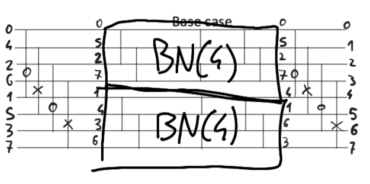

Benes -> caratteristiche rete: $$L(N)=2\log_2N-1; \quad S(N)=N\log_2N-\frac{N}{2}$$Dimostrazione:
	bit-reversal -> diamo algoritmo per piazzare switch -> parto con una scelta, poi seguo implicazioni
	

Rete Benes quasi ottima -> $N\log_2N-N\log_2e+o(N)\leq S(N)=N\log_2N-N/2$ -> si può migliorare ma non molto -> possiamo rimuovere un switch da ogni stage prima di caso base -> $\tilde{S}(N)=N\log_2N-N+1$