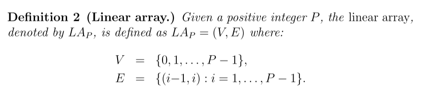

ARCHITETTURE PARALLELE
Consideriamo GRAFO COMPLETO $K_P=(V,V\times V)$ -> $|V|=P, |E|=\binom{P}{2}=\frac{P(P-1)}{2}$
Consideriamo LINEAR ARRAY (grafo minimamente connesso):

Grado di nodo confrontabile con numero collegamenti di chip