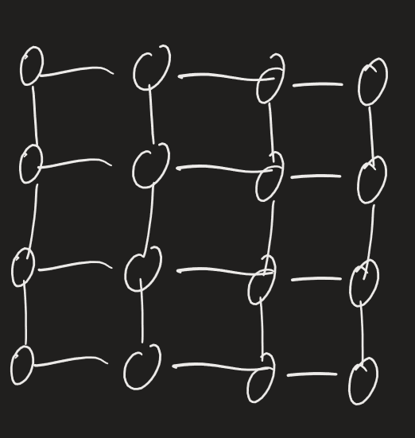

Decisione su priorità per lato affetto da congestione impatta prestazioni
Consideriamo guest hypercube, host linear array, $P=2^d$ nodi per entrambi -> facile implementare FFT su hypercube per massimo parallelismo
Calcoliamo $T(E_j)$
Se abbiamo messaggio A,B,C,D su nodi 0,1,2,3 di linear array e devono arrivare a 4,5,6,7, possiamo spostarli in modo sincrono
Tempo impiegato da linear array per routare messaggio che in ipercubo è routato in certa dimensione: $T(E_j)=2^j$
Possiamo partizionare messaggi in base a dimensione e routare messaggi una dimensione alla volta -> slowdown: $$S=\sum_{j=0}^{d-1}T(E_j)=\sum_{j=0}^{d-1}2^j=2^d-1=P-1$$Alto slowdown -> in compenso, $c\geq\frac{P}{2}$ -> $S\geq c\geq \frac{P}{2}$ -> ottimale entro fattore 2
Paradigma ASCEND: $E_0 E_1 \ldots E_{d-1}$; paradigma DESCEND: $E_{d-1} E_{d-2} \ldots E_0$: $$T_{ASC}=T_{DES}=\sum_{j=0}^{d-1}T(E_j)\approx P$$Tempo di computazione uguale a slowdown per prima versione $$S_{ASC}=S_{DES}=\frac{T_{H}}{T_{G}}=\frac{P}{\log_2 P}$$($P$ passaggi di linear array simulati da $\log_2 P$ passaggi da hypercube)
Ogni singolo passaggio usa una sola dimensione
Questa versione è ottima -> $\Omega$ permutazione: DESCEND paradigm

Paradigma BITONIC SORTING: $$\begin{matrix} E_0 \\ E_1 & E_0 \\  \ldots & \ldots \\ E_{d-1} & E_{d-2} & \ldots & E_0 \end{matrix}$$$$T_{BS}(P)=\sum_{j=0}^{d-1}(d-j)T(E_j)=\sum_{j=0}^{d-1}(d-j)2^j=d\sum_{j=0}^{d-1}2^j-\sum_{j=0}^{d-1}j2^j$$Come fare seconda sommatoria: $$\sum_{j=0}^{d-1}x^j=\frac{x^j-1}{x-1} \ \forall x\neq1 \quad \Rightarrow \quad \sum_{j=0}^{d-1}jx^{j-1}=\frac{d}{dx}\left(\frac{x^d-1}{x-1}\right) \quad \Rightarrow \quad \sum_{j=0}^{d-1}jx^j=x\frac{d}{dx}\left(\frac{x^d-1}{x-1}\right)$$Recurrence relation: $$\begin{cases} T_{BS}(1)=0 \\ T_{BS}(P)=T_{BS}\left(\frac{P}{2}\right)+T_{DES}(P) \end{cases}$$Risolviamo tramite unfolding: $$T_{BS}(P)=T_{BS}\left(\frac{P}{2}\right)+T_{DES}(P)=T_{BS}\left(\frac{P}{4}\right)+\frac{P}{2}+P=\ldots=T_{BS}\left(\frac{P}{2^i}\right)+\left(\frac{P}{2^{i-1}}+\ldots+P\right)=$$$$=0+(2+4+\ldots+P)=(2P-1)-1=2(P-1)$$Dimensioni più veloci eseguite più volte

Definiamo reti con prestazioni intermedie tra ipercubo e array lineare
2-DIMENSIONAL MESH: 

Nodo in cima a sinistra: (0,0) (numero riga, numero colonna) $$degree(MESH(\sqrt{P}\times\sqrt{P}))=4 \quad \forall\sqrt{P}\geq3 \quad (0 \text{ per }P=0, 2 \text{ per } P=1)$$$$|E|=2\sqrt{P}(\sqrt{P}-1)$$$$diam(MESH(\sqrt{P}\times\sqrt{P}))=dist((0,0),(\sqrt{P}-1,\sqrt{P}-1))=2(\sqrt{P}-1)$$Tecnicamente abbiamo trovato upper bound per distanza tra quei due nodi -> dobbiamo dimostrare uguaglianza:
	se prendo percorso qualunque in grafo, in ogni step posso modificare distanza per 1 o in colonne o in righe: $$dist((i_1,j_1),(i_2,j_2))=|i_1-i_2|+|j_1-j_2|\leq2(\sqrt{P}-1) \Rightarrow$$$$\Rightarrow diam(MESH(\sqrt{P}\times\sqrt{P}))=2(\sqrt{P}-1)$$