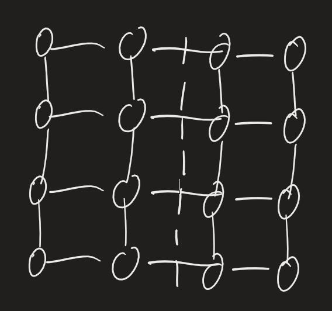
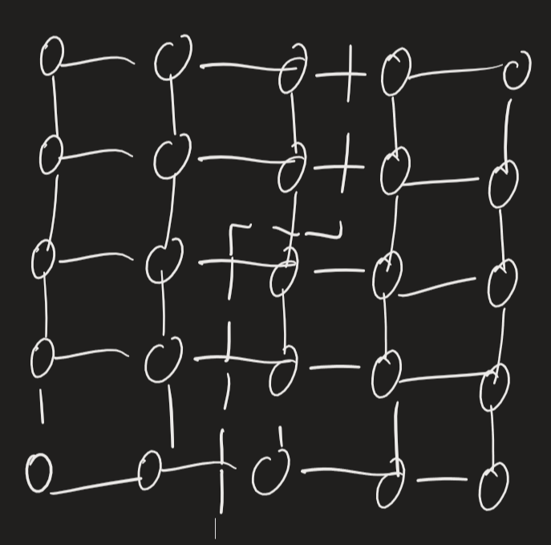
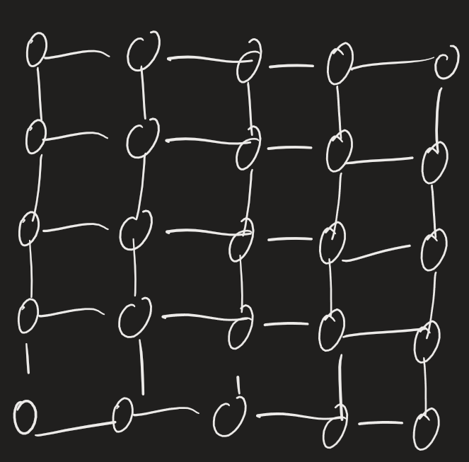

Prendiamo $G=MESH(\sqrt{P}\times\sqrt{P})$, vogliamo upper bound per $b_G(P)$:
	potrei separare metà nodi prendendo taglio verticale
	
	$$\delta_G(8)\leq4 \quad (12=\lfloor P/2\rfloor) $$
	
	$$ \delta_G(12)\leq \sqrt{P}+1$$
In generale: $$b_G(P)\leq\sqrt{P}+(\sqrt{P} \text{ MOD } 2) \quad (P=MESH(\sqrt{P}\times\sqrt{P}))$$
SIMULATION OF $H_d$ SU $MESH(\sqrt{P},\sqrt{P})$, $P=2^d$, $d$ PARI

Scegliamo embedding -> numeriamo nodi: prima riga 0,1,2,3, seconda riga 4,5,6,7, etc. -> ROW-MAJOR EMBEDDING
	$$0\leq k<P; \quad \phi_{RM}(k)=(\lfloor k/\sqrt{P}\rfloor, k \text{ MOD }\sqrt{P})=(i,j)$$
	Prendiamo rappresentazioni binarie:
$$k:k_{d-1}\ldots k_0 \equiv k_{d-1}\ldots k_{d/2}k_{d/2-1}\ldots k_0; \quad i:i_{d/2-1}\ldots i_0; \quad j:j_{d/2-1}\ldots j_0$$
	$i$ ricavabile da $k_{d-1}\ldots k_{d/2}$, $j$ ricavabile da $k_{d/2-1}\ldots k_0$
Definiamo embedding: $$\xi_{RM}=(\phi_{RM},\psi_{RM})$$E.g. dimensione $E_0$ in mesh comprende (0,1), (2,3), (4,5), ...; $E_2$ comprende (0,2), (1,3) (4,6), etc.; $E_3$ comprende (0,4), (8,12), ...; $E_4$ comprende (0,8), (4,12), ...
Definiamo routing function: $\psi_{RM}(v,v')=$ IL percorso più breve tra $\phi_{RM}(v)$ e $\phi_{RM}(v')$
Es. se tra $v$ e $v'$ cambia solo bit in prima metà, cambia solo riga; se cambia solo in seconda metà, cambia solo colonna
Calcoliamo tempo di routing per dimensione h: $$T(E_h)=\begin{cases} 2^h & 0\leq h<\frac{d}{2} \\ 2^{h-d/2} & \frac{d}{2}\leq h<d\end{cases}$$$$\sum_{h=0}^{d-1} T(E_h)=(\sqrt{P}-1)$$Per computazione arbitraria di $G=H_d$: $$S=\frac{T_G}{T_H}$$Inoltre: $$T_{ASC}=T_{DES}; \quad T_{BEN}(P)=4(\sqrt{P}-1)$$$$\delta_{MESH}(P)\geq\frac{P/2}{4(\sqrt{P}-1)}\approx\frac{\sqrt{P}}{8}$$$$T_{BS}(P)=\sum_{h=0}^{d-1}(d-h)T(E_h)\leq(\log_2P)T_{DES}(P)\leq2(\sqrt{P}-1)\log_2P$$$$T_{BS}(P)\geq T(E_{d/2-1})(d/2+1)\geq \frac{\sqrt{P}}{2}\frac{\log_2P}{2}$$
$$T_{BS}(P)=T_{BS}(P/2)+T_{DES}(P)$$