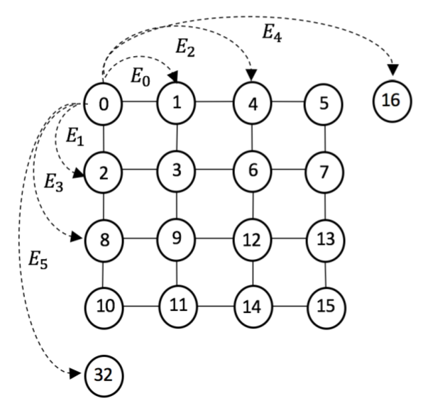
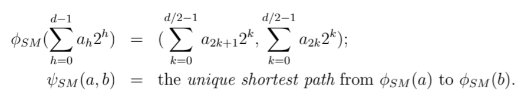

SHUFFLE-MAJOR EMBEDDING

Routing function restituirà unico percorso più breve tra nodi:
$$T(E_h)=2^{\lfloor h/2\rfloor} \ \forall h$$$$T_{BS}(P)=\sum_{h=0}^{d-1}(d-h)T(E_h)=7\sqrt{P}-4\log_2(4\sqrt{P})+1$$
Calcolo recurrent relationship: $$\begin{cases} T_{BS}(P)=T_{BS}(P/4)+4\sqrt{P}-\frac{\sqrt{P}}{2} \\ T_{BS}(1)=0 \end{cases}$$Soluzione sbagliata a problema, perchè non consistente con caso base:
$$T_{BS}(P)=\beta\sqrt{P} \quad \Rightarrow \quad \beta\sqrt{P} = \beta\frac{\sqrt{P}}{2}+\frac{7}{2}\sqrt{P} \quad \Rightarrow \quad \beta=7$$
Errore comune:
	ho dati in row-major order in mesh, problema vuole sorting
	dato row-major, tempo $O(\sqrt{P}\log_2(P))$ -> sbagliato
	nessuno obbliga a usare algoritmo row-major -> potrei usare anche shuffle-major
	se facciamo in certo modo e per passo dopo serve altro modo, in mezzo facciamo permutazione (tempo $O(\sqrt{P})$) -> Benes utile per questo: indipendentemente da I/O protocol, posso applicarlo per riorganizzare dati in tempo $O(\sqrt{P})$

Calcoliamo lower bound in mesh per $b_G(P)$: $$b_G(P)\geq\frac{P/2}{T_G^{perm}}\geq\frac{P/2}{4\sqrt{P}}=\frac{\sqrt{P}}{8}$$Possiamo ottenere lower bound migliore usando embedding ($l=1$) con $G=K_P$, $H=MESH(\sqrt{P}\times\sqrt{P})$
	$\phi$: qualunque mapping 1-1
	calcoliamo diametro di mesh: $$d=diam(H)=2(\sqrt{P}-1)$$consideriamo in mesh arco $f$ tra nodo con riga $i$ e nodo con riga $i$ e colonna $j$ -> lo prenderanno percorsi che hanno come partenza nodi che sono in riga $i$ oppure che hanno come destinazione nodi di colonna maggiore o uguale a $j$: $$c(j)=j(\sqrt{P}-j)\sqrt{P}$$serve valore massimo: $$j_{max}=\frac{\sqrt{P}}{2}$$quindi congestione di embedding sarà: $$c=\frac{\sqrt{P}}{2}\left(\sqrt{P}-\frac{\sqrt{P}}{2}\right)\sqrt{P}=\frac{P\sqrt{P}}{4}$$Teorema generale: $$c\geq\frac{\delta_G(P/2)}{\delta_H(P/2)}=\frac{(P/2)^2}{\delta_H(P/2)}$$$$\delta_H\left(\frac{P}{2}\right)\geq\frac{1}{c}\frac{P^2}{4}=\frac{\frac{P^2}{4}}{\frac{P\sqrt{P}}{4}}=\sqrt{P}$$Ma sappiamo anche che: $$\delta_H(P/2)\leq\sqrt{P}$$