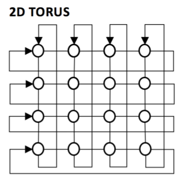
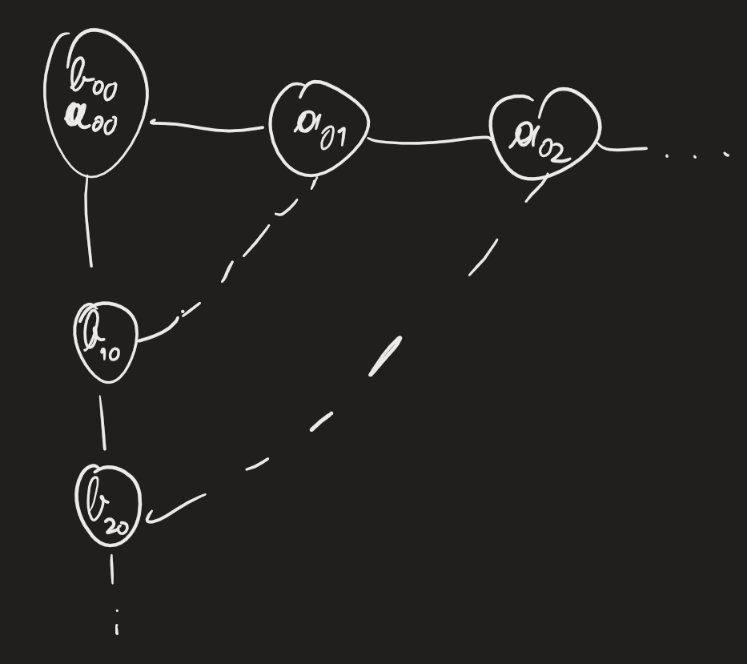

$$T_{BS}(P)\approx7\sqrt{P}$$Lower
 bound possibili per $T_{SORT}$:
- diametro: $\geq2(\sqrt{P}-1)$
- bisection width: $\geq\frac{P/2}{\sqrt{P}}=\frac{\sqrt{P}}{2}$
- work: $\frac{P\log_2P}{P}=\log_2P$

Lower bound per qualunque G dove posso ordinare: $$b_G^P\geq\frac{P/2}{T_{SORT}(P)}$$RICORDARE: se posso ordinare posso anche permutare

Estendere mesh completando colonne e righe con un arco come linear array in ring: 2D TORUS

Vogliamo risolvere moltiplicazione di matrici su mesh

Dimostriamo che ring è al massimo veloce il doppio di linear array
	consideriamo embedding con ring guest e linear array host -> prendiamo embedding base: $$d=P-1; \quad c=2$$Miglior embedding: in ordine, $v_0,v_7,v_1,v_6,v_2,v_5,v_3,v_4$ -> prestazioni: $$l=1, \quad d=2, \quad c=2, \quad S=O(l+dc)=O(1),S=2$$

Matrix multiplication: $$C=AB, \quad A,B\in\mathbb{R}^{n\times n}, \quad n=\sqrt{P}$$
	prendiamo mesh quadrata 4x4
	
	