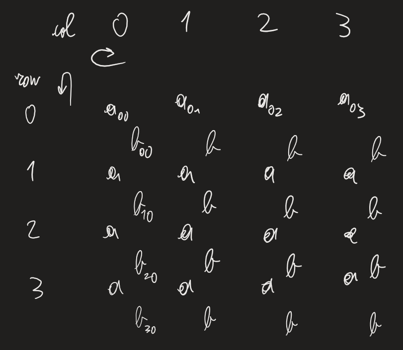
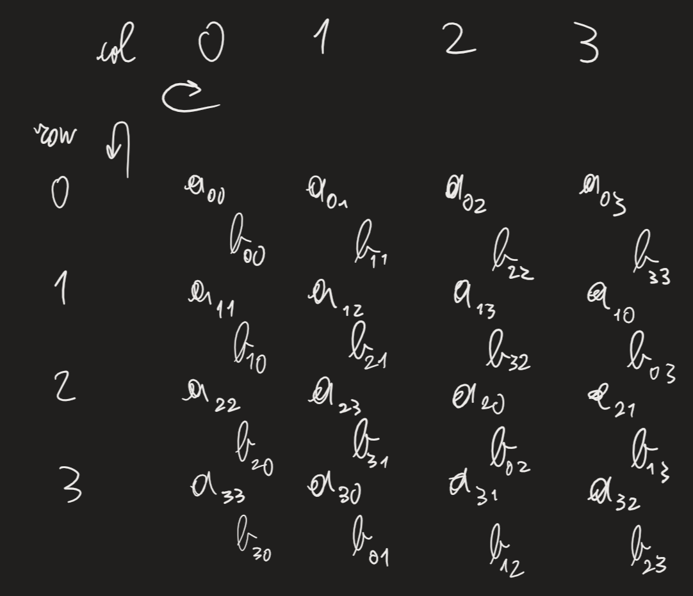

Disporre elementi in mesh per moltiplicazione di matrici

(pre)shift
- row(i) left by i
- col(j) up by j
Shifto ogni matrice

Ora facciamo moltiplicazione e accumulazione -> passi di comunicazione (muovere dati) ed esecuzione accumulazione
Prendiamo un nodo: e.g. $a_{13},b_{32}$ -> operazione -> poi arriveranno nodi adiacenti
Dati mesh e matrici A, B, C, tutte $\sqrt{P}\times\sqrt{P}$: $$T=3\sqrt{P}=O(\sqrt{P})$$Algoritmo ottimo per lavoro: $$\text{work}=(\sqrt{P})^3=P\sqrt{P}$$Questo tipo di strutture/algoritmi: SYSTOLIC ARRAYS/ALGORITHM