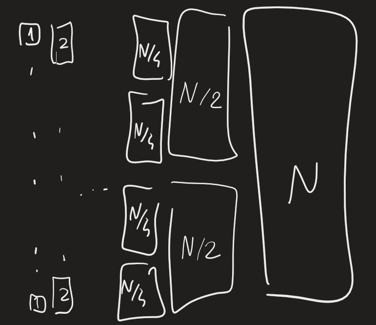

PARALLEL SORTING
Primo passo: possibile parallelizzare algoritmi sequenziali? -> guardiamo alg. con complessità $O(n\text{log}n)$: merge, quick, heap

Heap sort:
	X: sequenza da ordinare -> costruire heap contenente X -> Y: sort(x) costruita ripetendo operazioni di estrazione minimo
Per costruire heap, procedura HEAPIFY: tempo lineare -> sviluppata in contesto sequenziale
	divide and conquer: costruire due heap separati, costruire radice comune
	$T(N)=2T(N/2)+O(\log N)=O(N)$
Difficile parallelizzare procedura di rimozione di heap -> non migliore algoritmo su cui lavorare

Quick sort: 
	prendo elemento pivot -> da un lato elementi minori, dall'altro elementi maggiori -> ordino sottoinsiemi ricorsivamente
Posso ordinare sottoinsiemi in parallelo -> prima devo confrontare tutti con pivot: posso fare confronti in parallelo -> se avessi un processore per ogni elemento, ognuno confronterebbe un elemento in parallelo, ma dove salvo sottoinsiemi? -> rischio di fare scrittura in sequenza
Sottoinsiemi possono avere dimensioni diverse, ma in media non è così
Possiamo lavorare su questo algoritmo, ma richiede molto lavoro -> garantito che sottoinsiemi siano uguali se prendo mediana (possiamo farlo in tempo lineare) -> $T_Q(N)=2T_Q(N/2)+O(N)=O(n\log n)$ -> in tempo necessario per operazione per mediana, c'è anche termine costante/sublineare molto alto -> alternativa: prendere 3 elementi casuali e prendere mediana tra loro -> porta grande miglioramento

Merge sort:
	divide and conquer: dividiamo sequenza in 2, ordiniamo sottosequenze, fondiamo sottosequenze ordinate
Parallelizzare merge -> problema: confronto successivo ha più casi in base a dove sono elementi -> se facciamo entrambi confronti così da avere già risultato pronto, usiamo tante risorse
Merge è sequenziale, ma possiamo parallelizzare sort -> data esecuzione parallela: $$\begin{cases} T_S(N) = T_S(N/2)+T_M(N)\approx T_S(N/2)+N \\ T_S(1)=0\end{cases}\Rightarrow T_S(N)=2N$$Algoritmo divide and conquer analizzabile tramite albero di ricorsione

Sottoinsieme di dim. 2 possono essere ordinati con una sola operazione -> mi servono $p=N/2$ processori -> per sottoinsieme di dim. 4, $p=N/4$ processori -> dim. sequenze raddoppiano, numero processori necessari dimezzato
Non metodo buono (tanti processori che man mano vengono utilizzati sempre meno) -> algoritmo non è abbastanza parallelo

Algoritmo ha grado di parallelismo p se può tenere p processori sempre occupati
W = numero operazioni = $N\log N$, T = 2N -> $W/T = \frac{\log_2N}{2}$: operazioni fatte ad ogni passo -> buon numero di processori: circa $\log_2N$