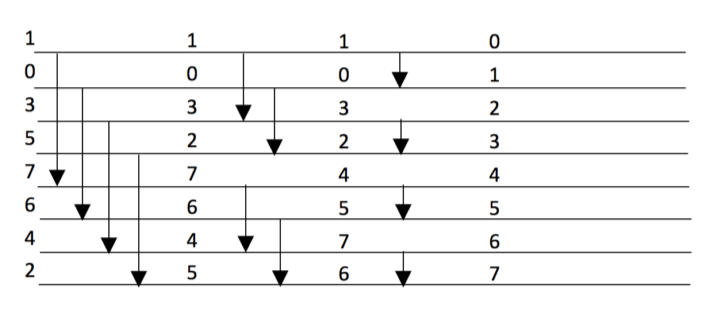

Per migliorare ancora, ci serve nuovo algoritmo per merge -> creato da Kenneth Batcher: BITONIC MERGING, e poi BITONIC SORTING
	Sia $\underline{x}=(x_0,\ldots,x_{N-1})$ sequenza da universo totalmente ordinato (se $a<b$ non può essere $b<a$; se $a<b,b<c$, allora $a<c$); diciamo che $\underline{x}$ è UP-DOWN SEQUENCE se consiste di prefisso non-decrescente seguito da suffisso non-crescente; diciamo che è BITONIC SEQUENCE se è cyclic shift di sequenza up-down
Es:
	$\underline{x}=35764210$ ($357$ prefisso non-dec., 64210 suffisso non-cre.) -> up-down
	shift a sx di 2: $76421035$ -> bitonic
Dopo fase divide, se iniziamo con sequenza updown non abbiamo per forza due sequenze updown -> invece, se divido bitonic ottengo sequenze bitonic

Date due sequenze ordinate e due processori: uno parte da minimo, altro da massimo -> si incontreranno
Date due sequenze ordinate: se confronto minimo di uno con massimo dell'altro, confronto numero successivo di uno e precedente dell'altro, e avanti -> confronto valori crescenti da uno e decrescenti dall'altro -> non appena elemento 1 > elemento 2, scambio numeri tra sequenze
Se prima di iniziare riscrivo sequenze invertendo la seconda, devo fare confronti tra elementi con stesso indice -> dopo confronti, in una sequenza tutti valori minori rispetto ad altra sequenza -> operazione equivalente a pivot di quick sort (come se avessi scelto mediana come pivot)
Voglio fare operazione ricorsivamente -> da due sequenze ordinate ottengo una bitonic

Definizioni:
	$L\underline{x} = (\min(x_0,x_{N/2}),\ldots,\min(x_{N/2-1},x_{N-1}))$
	$U\underline{x} = (\max(x_0,x_{N/2}),\ldots,\max(x_{N/2-1},x_{N-1}))$
Proprietà quando applico $L\underline{x},U\underline{x}$ a sequenza bitonic:
	1 - $\max(L\underline{x})\leq\min(U\underline{x})$
	2 - $L\underline{x}$, $U\underline{x}$ bitonic
Da qui otteniamo algoritmo divide and conquer BITONIC MERGE BM(N):
	in input sequenza $\underline{x}$ -> operatore L/U -> escono sottosequenze $L\underline{x},U\underline{x}$ -> entrambe vanno in ricorsione BM(N/2) -> concatenazione -> esce $\text{sort}(\underline{x})$
Relazione di ricorsione: $$\begin{cases} T_{BM}(N)=T_{BM}(N/2)+T_{LU}(N) \\ T_{BM}(1)=0 \end{cases}$$Confronti per L/U sono disgiunte/indipendentei -> posso eseguirli in parallelo -> $T_{LU}=1$
Soluzione sistema: logaritmico, $T_{BM}(N)=\log_2N$

Grafo delle operazioni di algoritmo da cui possiamo misurare grado di parallelismo
Rappresentiamo COMPARATOR EXCHANGER: dato a,b restituisce minimo e massimo
Ogni riga rappresenta un elemento di sequenza -> man mano, confronti sono a distanza sempre minore
$T_{BM}(N)=\log_2N$; $C_{BM}(N)=\frac{N}{2}\log_2N$ -> ricorrenza: $$\begin{cases} C_{BM}(N)=2C_{BM}(N/2)+N/2 \\ C_{BM}(1)=0 \end{cases}$$Buono risultato per tempo, meno per confronti di merge (è aumentato) -> se per un algoritmo di merge posso pianificare confronti senza sapere input, si può dimostrare che $C(N)=\Omega(N\log N)$; se posso fare piano dinamico, posso ottenere $C(N)=\Omega(N)$ -> posso usare ADAPTIVE BM