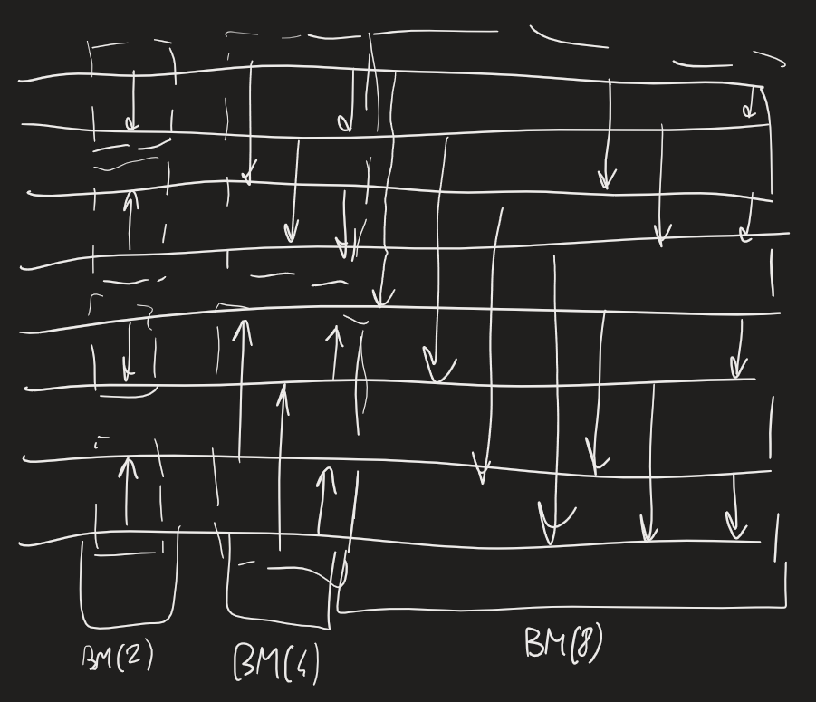
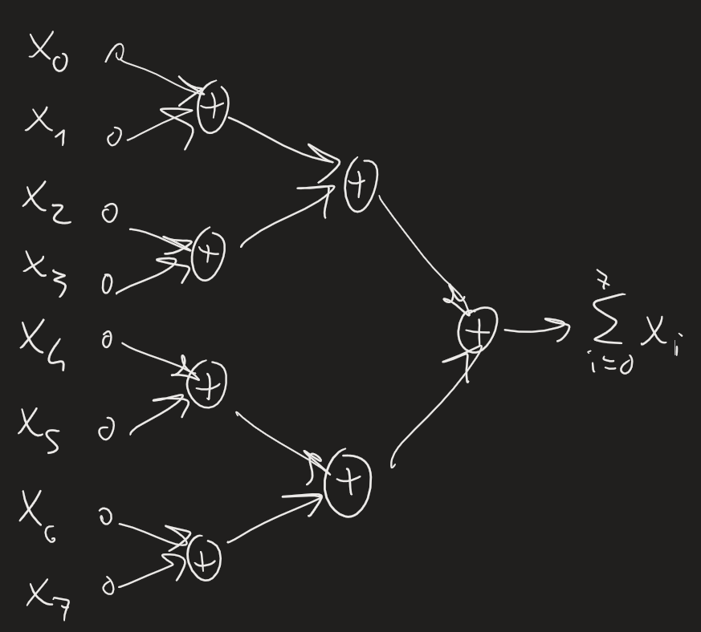

BITONIC SORTING:
BS(N): chiamate ricorsive BS(N/2), ordinate in direzioni opposte -> vanno in BM(N) -> ritorna sort(x)
Prestazioni merger: $$\begin{cases} T_{BM}(N)=\log_2N \\ C_{BM}(N) = \frac{1}{2}N\log_2N \end{cases}$$Ricorrenza per BS: $$\begin{cases} T_{BS}(N)=T_{BS}(N/2)+T_{BM}(N)=T_{BS}(N/2)+\log_2N \\ T_{BS}(1)=0 \end{cases}$$$$T_{BS}(N/2)=T_{BS}(N/4)+(\log_2N-1)+\log_2N=\ldots=T_{BS}(N/2^i)+\sum_{j=1}^i(\log_2N-(j-1))=$$$$=T_{BS}(1)+1+2+\ldots+\log_2N=0+1+2+\ldots+\log_2N=\frac{(\log_2N+1)\log_2N}{2}$$Numero operazioni: $$\begin{cases} C_{BS}(N)=2C_{BS}(N/2)+C_{BM}(N)=2C_{BS}(N/2)+\frac{1}{2}N\log_2N \\ C_{BS}(1)=0\end{cases}$$$$C_{BS}(N)=\frac{N}{4}(\log_2N+1)\log_2N$$Parallelismo in cambio di operazioni aggiuntive
In realtà avremo P < N processori -> consideriamo reale numero di processori: $$T_{BS}(N,P)=\frac{N}{P}\log_2\frac{N}{P}+\frac{(\log_2P+1)\log_2P}{2}\frac{N}{P}$$Rete per BS:

Immaginiamo di voler sviluppare hardware specifico per questo algoritmo -> possiamo programmare confronti a priori -> oppure possiamo programmare in base a bit di numeri -> elaboro bit + significativi, mandare risultati a comparatore successivi
Possiamo parallelizzare comparatori totalmente o parzialmente

Data rete, possiamo dire guardandola se ordina input? -> vorremmo test
A comparatore importa solo di confronto, non di valori assoluti -> se testo tutte permutazioni di una sequenza, allora funziona su tutte sequenze di stessa lunghezza -> se prendo sequenze con stessi ordini relativi, allora funziona su tutte -> e.g. ordina sequenza del tipo (112 92 31 52) iff ordina (3 2 0 1) -> iff ordino ogni sequenza di bit

AKS SORTING NETWORK: proprietà $T_{AKS}(N)=O(c\log_2N), C_{AKS}(N)=O(N\log_2N)$ -> utile soprattutto a livello teorico

MISURARE PARALLELISMO IN ALGORITMI
Grado p se posso mantenere p processori attivi per una certa frazione di tempo
Organizzo algoritmi in stages -> se hanno tutti stesso numero di op., facile trovare grado di parallelismo -> se hanno numeri diversi di op., risposta più difficile

Calcolare costo computazione -> es:
	8 numeri, vogliamo calcolare somma in modo parallelo -> possiamo sommarli due a due, continuiamo così fino a sommarli tutti
	man mano usiamo 4->2->1 unità per sommare
	rappresentabile con COMPUTATION DAG:
	
	abbiamo: nodi di input ($I$), nodi per operazioni ($V$), nodi di output ($O$)
	condizione: ogni nodo di input deve essere utile -> definiamo $O$ (non per forza solo ultimissimo nodo)
	come calcolare parallelismo? ragionevole # stage/processori -> però potremmo anche organizzare stage in modo diverso -> si segue criterio: primo stage: tutte operazioni che posso fare subito; poi, quello che posso fare subito dopo op. primo stage -> in DAG qualunque, stesso nodo può essere in più percorsi

(finire pagina 15)