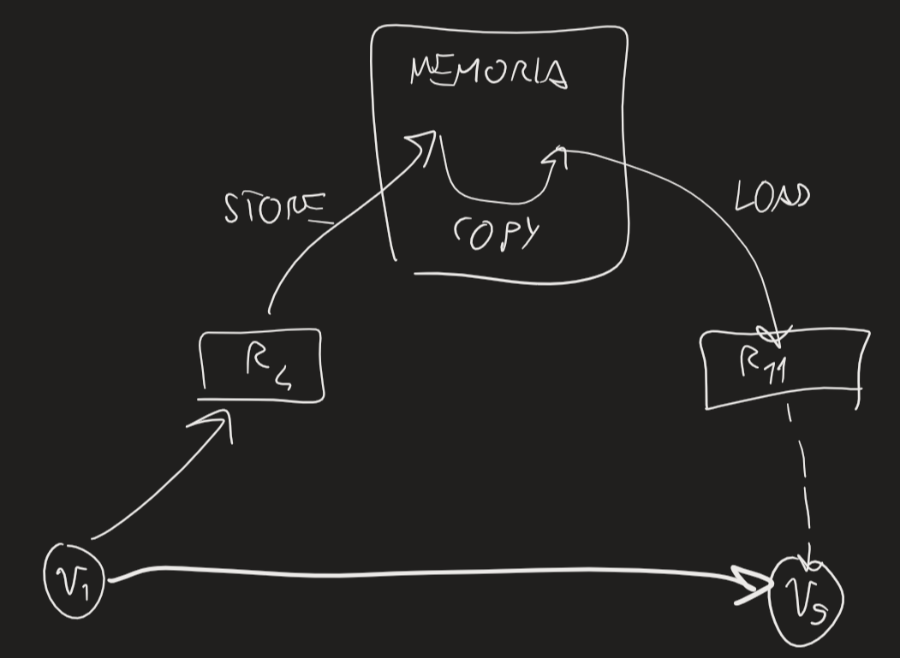
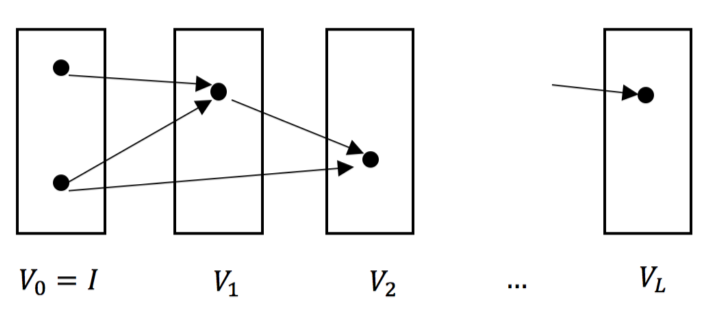

DATA-DIPENDENCE CHAIN
	sequenza di operazione $A=A_1,A_2,\ldots,A_l=B$ tale che $\forall \ j\in[2,l]$ il risultato di $A_{j-1}$ è operando di $A_j$
In macchina ideale, tempo minimo per realizzare computazione = lunghezza di data-dipendence chain più lunga
CDAG modella una certa esecuzione di algoritmo -> per certi algoritmi, diverse esecuzioni possono dare stesso CDAG
Algoritmo sequenziale: per ogni operazione, un nodo -> dobbiamo tenere traccia di dati generati da operazioni -> alcuni disponibili come input -> quando nodo esegue operazione, mette dato da qualche parte (e.g. registro) -> quando dato generato da un nodo viene usato da altro nodo, mettiamo arco tra quei due nodi -> dati nodi $v_1,\ldots,v_{|V|}$, archi andranno solo da sx a dx -> hanno ordine topologico -> posso scegliere qualunque ordine topologico

Studiamo alg. sequenziali -> metrica principale: tempo computazionale -> se vogliamo tenere conto di tempo di accesso a memoria, ordini topologico diversi avranno tempi di computazione diversi -> TEMPORAL LOCALITY: posso caricare locazioni di memoria vicine (STACK DISTANCE di accessi: numero di "oggetti" diversi tra quei due) che userò molto in cache
In computazioni sequenziali, spesso si usa molto tempo per spostare dati -> dato che cache è piccola, è utile perchè stragrande maggioranza di programmi gode di temporal locality -> proprietà di algoritmo specifico, non di CDAG e basta

Es: moltiplicazione di matrici
	quale prodotto riga-colonna dovrei fare per prima? -> ogni permutazione va bene -> inoltre, ogni ordine in cui eseguire moltiplicazioni tra elementi va bene -> posso anche lasciare prodotti riga-colonna in sospeso e spostarmi su altri
	moltiplicazione per blocchi ottimale per cache (se $3k^2<$dimensione cache, con $k$ dimensione blocco) se SPATIAL LOCALITY
	conta ordine in cui abbiamo salvato matrici in memoria e ordine in cui programma le legge

Ci serve introdurre concetto di SCHEDULE per distribuire operazione tra processori
IDEAL MACHINE IM(P):
	P processori, memoria supposta infinita, operazioni sincronizzate; ogni risultato calcolato in certo ciclo viene considerato disponibile per ciclo successivo (ignorati costi di comunicazione)
GREEDY SCHEDULE:
	
	possiamo fare operazione iff operandi sono in stage precedenti -> almeno uno dev'essere in precedente
T(P) = tempo per eseguire C in IM(P) -> $T(+\infty) = L$ -> facile vedere che $T(+\infty)\leq L$, dimostriamo che $T(+\infty)\geq L$:
	un'operazione in ultimo set deve aspettare operando da set precedente, si può continuare fino all'inizio

- $V_0=I$
- $\forall \ j>0 \ V_j=\{v:v\in(V\setminus(V_0\cup\ldots\cup V_{j-1}))\mbox{ and if }(u,v)\in E \mbox{ then } u\in(V_0\cup\ldots\cup V_{j-1})\}$
